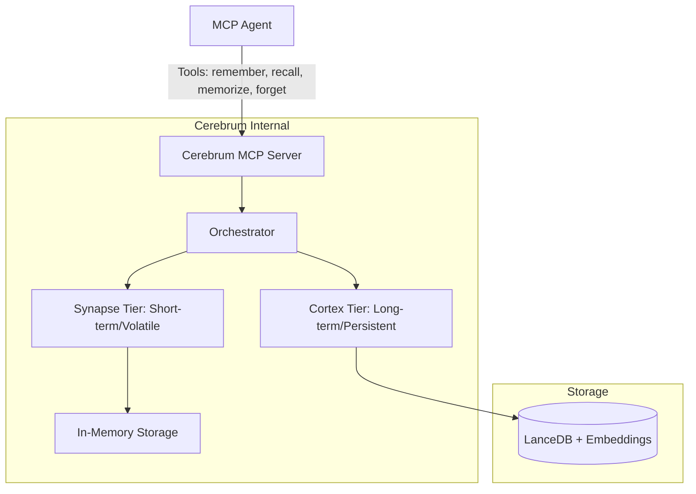
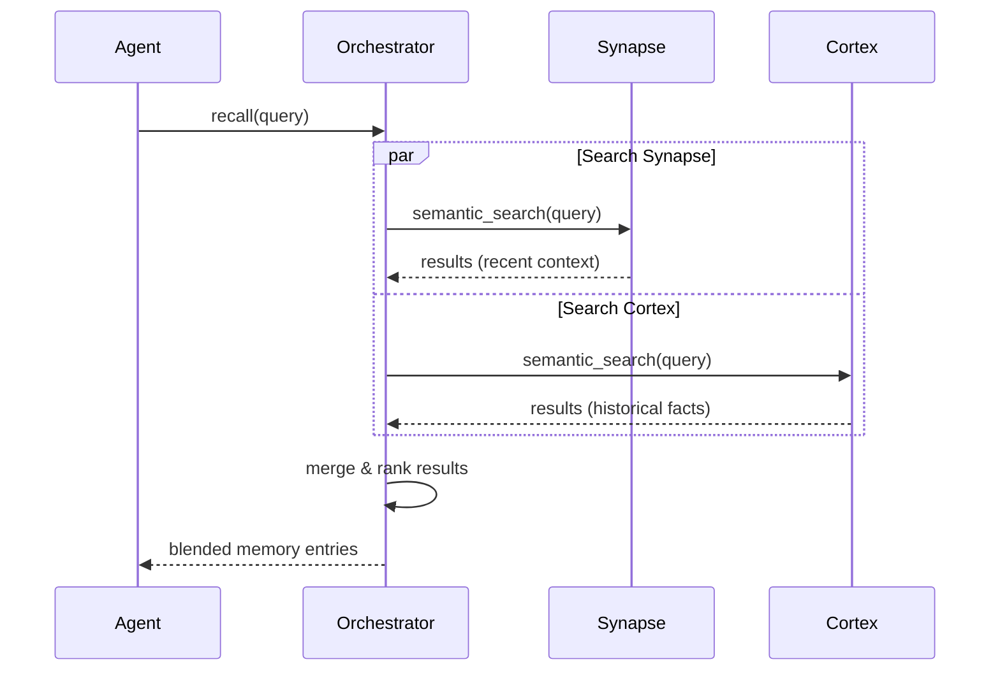

# Cerebrum Architecture

## System Overview

Cerebrum is a two-tier agent memory subsystem implemented as a single Model Context Protocol (MCP) server. It provides agents with both short-term, volatile memory and long-term, persistent memory through a unified tool interface.

## Memory Tiers

### 1. Synapse (Short-term)
- **Nature:** Volatile, in-memory.
- **Scope:** Per-session/interaction context.
- **Lifecycle:** Cleared when the session ends or if manually purged.
- **Purpose:** Rapid retrieval of recent conversation context and immediate task details.

### 2. Cortex (Long-term)
- **Nature:** Persistent, disk-backed.
- **Scope:** Cross-session/global persistence.
- **Implementation:** LanceDB using vector embeddings for semantic search.
- **Lifecycle:** Durable; survives server restarts.
- **Purpose:** Long-term facts, user preferences, and historical context.

## Core Workflow: The Recall Process

When an agent calls `recall`, the Orchestrator performs a blended search across both tiers.

