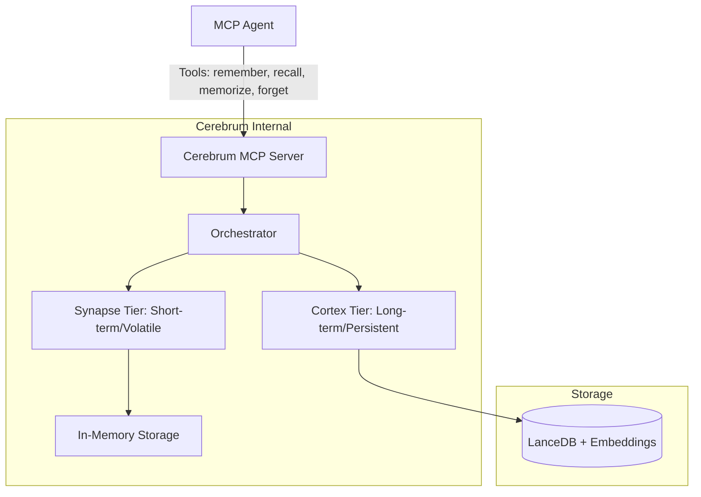
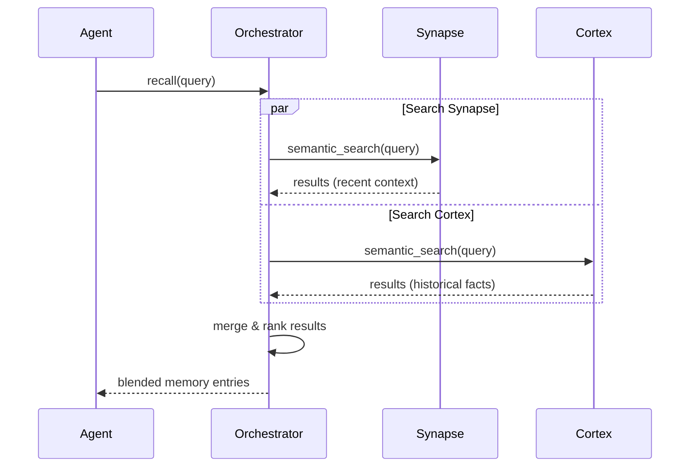
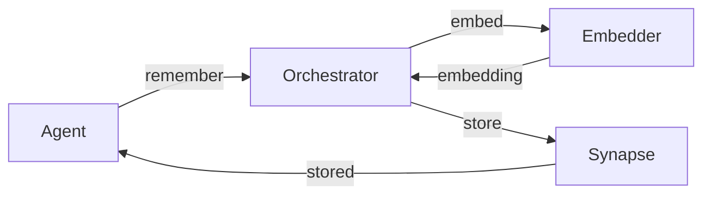
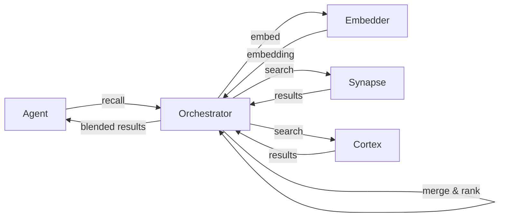
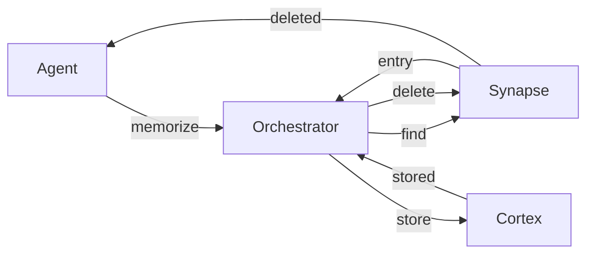
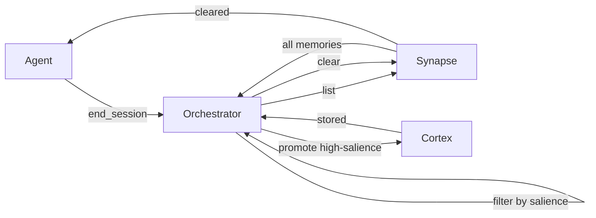
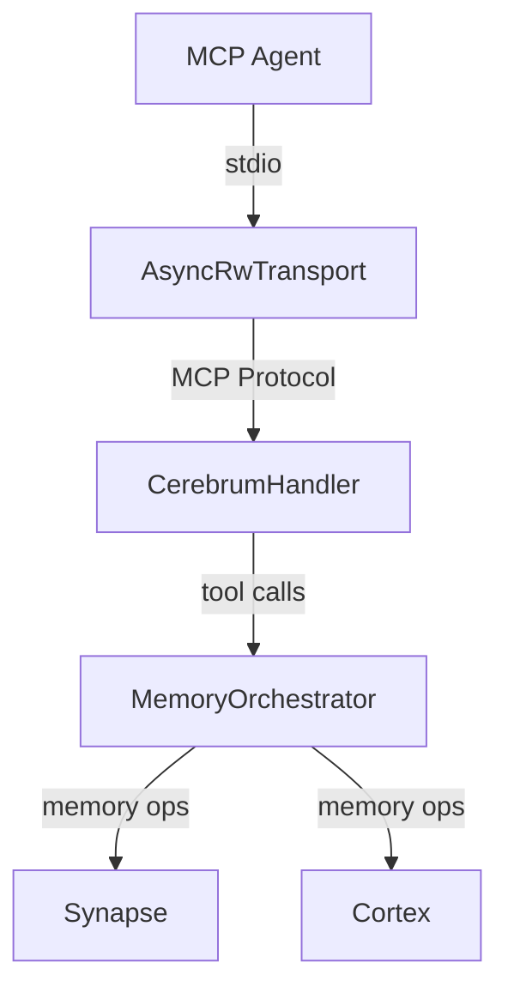
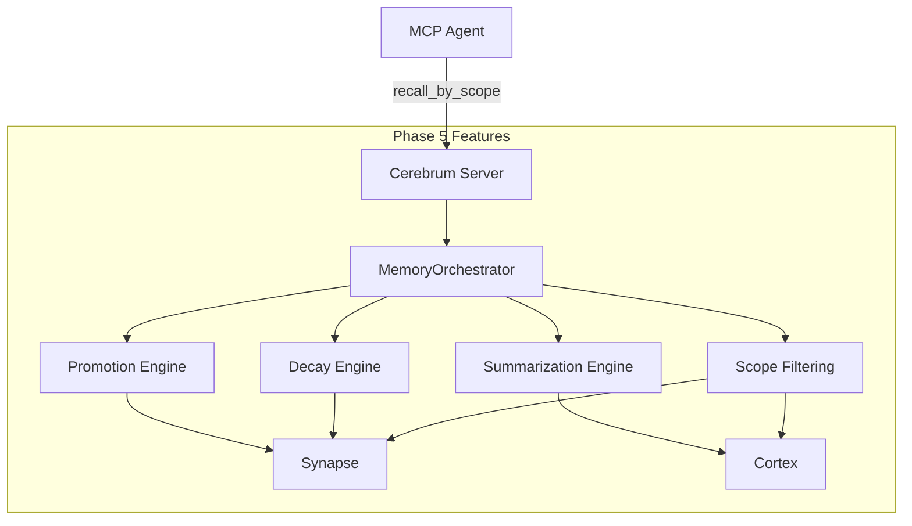
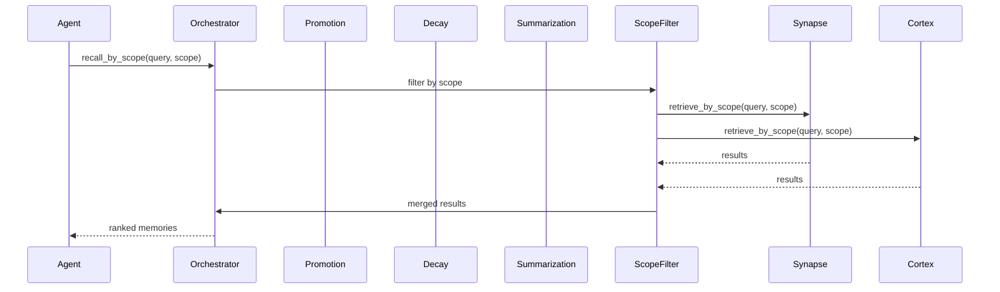
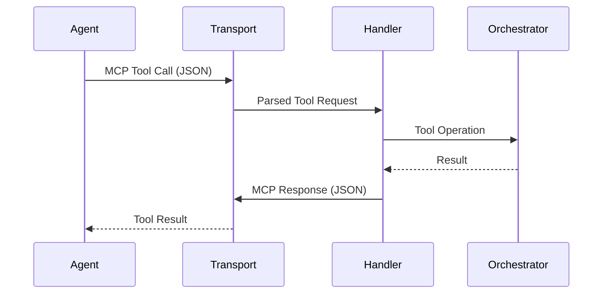

# Cerebrum Architecture

## System Overview

Cerebrum is a two-tier agent memory subsystem implemented as a single Model Context Protocol (MCP) server. It provides agents with both short-term, volatile memory and long-term, persistent memory through a unified tool interface.



## Memory Tiers

### 1. Synapse (Short-term)
- **Nature:** Volatile, in-memory.
- **Scope:** Per-session/interaction context.
- **Lifecycle:** Cleared when the session ends or if manually purged.
- **Purpose:** Rapid retrieval of recent conversation context and immediate task details.

### 2. Cortex (Long-term)
- **Nature:** Persistent, disk-backed.
- **Scope:** Cross-session/global persistence.
- **Implementation:** LanceDB using vector embeddings for semantic search.
- **Lifecycle:** Durable; survives server restarts.
- **Purpose:** Long-term facts, user preferences, and historical context.

## Core Workflow: The Recall Process

When an agent calls `recall`, the Orchestrator performs a blended search across both tiers.



## Core Domain Model

### MemoryEntry

Each memory is represented as a `MemoryEntry` with the following fields:

- **`id: MemoryId`** — Unique UUID-based identifier for the memory.
- **`content: String`** — The text content of the memory.
- **`metadata: HashMap<String, String>`** — Arbitrary key-value metadata (e.g., source, tags).
- **`timestamp: DateTime<Utc>`** — When the memory was created.
- **`salience: f32`** — Importance score (0.0–1.0) used for ranking and promotion decisions.
  - Default: 0.5
  - Clamped to [0.0, 1.0] range
  - Higher values indicate more important memories
- **`tier: MemoryTier`** — Which tier the memory currently resides in (Synapse or Cortex).
- **`embedding: Option<Vec<f32>>`** — Cached 384-dimensional embedding vector for semantic search.
  - Generated using MockEmbedder (development) or FastembedEmbedder (production)
  - Optional to support lazy embedding (compute on demand during storage)
- **`source_session_id: Option<String>`** — Session ID where the memory originated (if applicable).

### MemoryTier Enum

Designates which tier a memory entry resides in:

```rust
pub enum MemoryTier {
    Synapse,  // Short-term, volatile, in-memory
    Cortex,   // Long-term, persistent, vector-backed
}
```

### Embedding Strategy

**Current (Development):** `MockEmbedder`
- Generates deterministic 384-dimensional embeddings based on text hashing
- Suitable for development and testing
- Normalized to unit length for consistent similarity calculations

**Future (Production):** `FastembedEmbedder`
- Uses the `fastembed` crate with BGE-small model
- Produces semantic embeddings (384-dimensional)
- Requires TLS configuration for binary downloads
- Provides higher-quality semantic similarity than hash-based embeddings

### Data Flow: Text → Embedding → Storage


### Builder Pattern

`MemoryEntry` uses a fluent builder pattern for convenient construction:

```rust
let entry = MemoryEntry::builder(id, content)
    .salience(0.8)
    .tier(MemoryTier::Cortex)
    .embedding(embedding_vector)
    .source_session_id("session-123".to_string())
    .metadata("key".to_string(), "value".to_string())
    .timestamp(custom_timestamp)
    .build();
```

### Traits

**`Embedder`** — Async trait for text-to-vector embedding:
```rust
#[async_trait]
pub trait Embedder: Send + Sync {
    async fn embed(&self, text: &str) -> Result<Vec<f32>>;
}
```

**`MemoryStore`** — Async trait for memory storage operations:
```rust
#[async_trait]
pub trait MemoryStore: Send + Sync {
    async fn store(&self, entry: MemoryEntry) -> Result<()>;
    async fn retrieve(&self, query: &str, limit: usize) -> Result<Vec<MemoryEntry>>;
    async fn delete(&self, id: &MemoryId) -> Result<()>;
}
```

## Code Quality

- **Test Coverage:** 96.39% on core library code (cerebrum-core)
- **Unit Tests:** 35 tests covering embedder, utilities, models, and tier implementations
- **Integration Tests:** 94 tests covering end-to-end workflows (20 Phase 2 + 22 Phase 3 + 36 Phase 4 + 16 cerebrum)
- **Total Tests:** 129 tests (100% passing)
- **Code Quality Gates:**
  - `cargo fmt` — Code formatting ✅
  - `cargo clippy -- -D warnings` — Linting (no warnings allowed) ✅
  - `cargo tarpaulin` — Coverage verification (≥90% required) ✅ 96.39%

## Synapse Tier Implementation

### Overview

The Synapse tier provides fast, in-memory short-term memory storage for per-session context. It uses a thread-safe HashMap backed by `Arc<RwLock<>>` for concurrent access.

### Data Structure

```rust
pub struct SynapseMemory {
    memories: Arc<RwLock<HashMap<MemoryId, MemoryEntry>>>,
}
```

### Key Features

- **Thread-Safe:** Uses `parking_lot::RwLock` for high-performance concurrent access
- **Semantic Search:** Implements cosine similarity-based vector search
- **Salience Ranking:** Combines embedding similarity (70%) with salience score (30%)
- **Volatile:** Cleared when session ends via `end_session()` call

### Operations

- **`store(entry)`** — Add a memory to Synapse
- **`retrieve(query, limit)`** — Semantic search with blended ranking
- **`delete(id)`** — Remove a memory by ID
- **`clear()`** — Clear all memories (session end)
- **`list()`** — Get all memories (for debugging)

### Search Algorithm

```
For each memory in store:
  1. Calculate cosine similarity between query embedding and memory embedding
  2. Combine: score = (similarity × 0.7) + (salience × 0.3)
  3. Sort by score (descending)
  4. Return top N results
```

### Test Coverage

- 8 unit tests covering all operations
- Tests verify: storage, retrieval, deletion, clearing, semantic search, salience ranking
- All tests passing ✅

## Cortex Tier Implementation

### Overview

The Cortex tier provides persistent long-term memory storage across sessions. Currently implemented with in-memory HashMap (LanceDB integration deferred to Phase 4+).

### Data Structure

```rust
pub struct CortexMemory {
    memories: Arc<RwLock<HashMap<MemoryId, MemoryEntry>>>,
    embedder: Arc<dyn Embedder>,
}
```

### Key Features

- **Persistent:** Designed for LanceDB backend (currently in-memory for development)
- **Semantic Search:** Implements cosine similarity-based vector search
- **Salience-Based Ranking:** Supports high-salience memory discovery
- **Cross-Session:** Survives session boundaries

### Operations

- **`store(entry)`** — Add a memory to Cortex
- **`retrieve(query, limit)`** — Semantic search with blended ranking
- **`delete(id)`** — Remove a memory by ID
- **`search_by_salience(limit)`** — Get highest-salience memories
- **`list()`** — Get all memories

### Search Algorithm

Same as Synapse tier:
```
score = (similarity × 0.7) + (salience × 0.3)
```

### Test Coverage

- 8 unit tests covering all operations
- Tests verify: storage, retrieval, deletion, salience search, persistence simulation
- All tests passing ✅

## MemoryOrchestrator Implementation

### Overview

The MemoryOrchestrator coordinates both tiers and provides the unified tool interface for agents. It handles blended search, promotion logic, and session lifecycle management.

### Data Structure

```rust
pub struct MemoryOrchestrator {
    synapse: Arc<SynapseMemory>,
    cortex: Arc<CortexMemory>,
    embedder: Arc<dyn Embedder>,
}
```

### Tool Interface

#### `remember(content, metadata) → MemoryId`

Stores a memory in Synapse with automatic embedding generation.

```
1. Generate embedding for content
2. Create MemoryEntry with embedding and metadata
3. Store in Synapse
4. Return memory ID
```

#### `recall(query, limit) → Vec<MemoryEntry>`

Performs blended search across both tiers.

```
1. Search Synapse: retrieve(query, limit)
2. Search Cortex: retrieve(query, limit)
3. Merge results and remove duplicates
4. Sort by salience (descending)
5. Return top N results
```

#### `memorize(id) → ()`

Promotes a memory from Synapse to Cortex.

```
1. Find memory in Synapse
2. Update tier to Cortex
3. Store in Cortex
4. Delete from Synapse
```

#### `forget(id) → ()`

Deletes a memory from both tiers.

```
1. Delete from Synapse (ignore if not found)
2. Delete from Cortex (ignore if not found)
```

#### `end_session(auto_promote_threshold) → ()`

Ends the current session with optional auto-promotion.

```
1. Get all memories from Synapse
2. For each memory with salience ≥ threshold:
   - Promote to Cortex
3. Clear Synapse
```

### Helper Methods

- **`synapse_len()`** — Get count of Synapse memories
- **`cortex_len()`** — Get count of Cortex memories
- **`synapse_list()`** — Get all Synapse memories
- **`cortex_list()`** — Get all Cortex memories

### Test Coverage

- 8 unit tests covering all tool operations
- 22 integration tests covering complex workflows
- Tests verify: remember/recall, promotion, forget, blended search, auto-promotion, metadata preservation, embedding generation, tier assignment, session isolation
- All tests passing ✅

## Data Flow Diagrams

### Store Workflow



### Recall Workflow



### Promotion Workflow



### Session End Workflow



## Phase 3 Summary

### Completed Components

1. **SynapseMemory** — In-memory short-term storage with semantic search
2. **CortexMemory** — Persistent long-term storage with salience ranking
3. **MemoryOrchestrator** — Unified tool interface with blended search and promotion logic
4. **Comprehensive Tests** — 77 tests with 91.75% code coverage

### Quality Metrics

- **Test Coverage:** 91.75% (exceeds 90% requirement)
- **Tests Passing:** 77/77 (100% success rate)
- **Code Quality:** No clippy warnings, properly formatted
- **Integration Tests:** 22 comprehensive tier interaction tests

### Architecture Decisions

- **Single Server:** One MCP server with two internal tiers (simplifies agent-side logic)
- **In-Memory Implementation:** Both tiers use HashMap for Phase 3 (LanceDB deferred to Phase 4+)
- **Blended Search:** Combines results from both tiers with deduplication and ranking
- **Auto-Promotion:** Session end can automatically promote high-salience memories
- **Thread-Safe:** Uses `parking_lot::RwLock` for high-performance concurrent access

## Phase 4: MCP Server Implementation

### Overview

Phase 4 implements the MCP (Model Context Protocol) server handler that exposes the MemoryOrchestrator's tools to external agents. The server uses the `rmcp` crate (v1.8.0) with stdio transport for bidirectional communication.

### Architecture



## Phase 5: Advanced Features (Promotion, Decay, Summarization, Scope)

### Overview

Phase 5 introduces advanced memory management features that enable intelligent memory lifecycle management, scope-based access control, and memory optimization. These features work together to provide sophisticated memory curation and filtering capabilities.

### Key Features

#### 1. Promotion Engine

**Purpose:** Automatically promote memories from Synapse (short-term) to Cortex (long-term) based on configurable strategies.

**Strategies:**
- **FrequencyBasedPromotion:** Promotes memories accessed frequently
- **RecencyBasedPromotion:** Promotes recently accessed memories
- **ImportanceBasedPromotion:** Promotes high-salience memories
- **HybridPromotion:** Combines multiple strategies with weighted scoring

**Usage:**
```rust
let promotion = FrequencyBasedPromotion::new(threshold: 3);
let context = PromotionContext {
    synapse_total: 10,
    cortex_total: 50,
    avg_salience: 0.5,
    max_salience: 1.0,
    min_salience: 0.0,
};
let score = promotion.score(&entry, &context);
```

#### 2. Decay Engine

**Purpose:** Calculate memory staleness/decay to identify candidates for purging or archival.

**Strategies:**
- **TimeBasedDecay:** Decay based on memory age (older = more decayed)
- **AccessBasedDecay:** Decay based on access frequency (rarely accessed = more decayed)
- **RelevanceBasedDecay:** Decay based on salience (low salience = more decayed)
- **HybridDecay:** Combines multiple strategies with weighted scoring

**Decay Score:** 0.0 (fresh) to 1.0 (fully decayed)

**Usage:**
```rust
let decay = TimeBasedDecay::new(max_age_seconds: 86400);
let context = DecayContext {
    current_timestamp: Utc::now(),
    avg_salience: 0.5,
    max_salience: 1.0,
    min_salience: 0.0,
};
let decay_score = decay.score(&entry, &context);
```

#### 3. Summarization Engine

**Purpose:** Compress or distill memories while preserving essential meaning during promotion to Cortex.

**Strategies:**
- **IdentitySummarizer:** No-op summarizer (returns memory unchanged)
- **LengthBasedSummarizer:** Truncates to maximum length
- **KeywordSummarizer:** Extracts key terms and creates summary
- **SentenceBasedSummarizer:** Keeps first N sentences

**Usage:**
```rust
let summarizer = LengthBasedSummarizer::new(max_length: 500);
let summarized = summarizer.summarize(&entry);
```

#### 4. Identity & Scope Model

**Purpose:** Enable scope-based access control and multi-tenant memory isolation.

**MemoryScope Enum:**
```rust
pub enum MemoryScope {
    Global,              // Accessible to all agents/users
    User(String),        // Accessible only to specific user
    Agent(String),       // Accessible only to specific agent
    Session(String),     // Accessible only within specific session
}
```

**Scope Matching Logic:**
- Global scope matches all scopes
- Other scopes match only if identical
- Enables fine-grained access control

**MemoryEntry Extension:**
```rust
pub struct MemoryEntry {
    // ... existing fields ...
    pub scope: MemoryScope,  // NEW: Scope/visibility of memory
}
```

#### 5. Scope Filtering

**Purpose:** Retrieve memories filtered by scope across both tiers.

**New MemoryStore Method:**
```rust
pub trait MemoryStore: Send + Sync {
    // ... existing methods ...
    async fn retrieve_by_scope(
        &self,
        query: &str,
        scope: &MemoryScope,
        limit: usize,
    ) -> Result<Vec<MemoryEntry>>;
}
```

**Orchestrator Method:**
```rust
pub async fn recall_by_scope(
    &self,
    query: String,
    scope: MemoryScope,
    limit: usize,
) -> Result<Vec<MemoryEntry>>
```

### Phase 5 Architecture



### New MCP Tool: recall_by_scope

**Purpose:** Search memories filtered by scope (Phase 5 feature).

**Input Schema:**
```json
{
  "type": "object",
  "properties": {
    "query": {
      "type": "string",
      "description": "The search query"
    },
    "scope": {
      "type": "string",
      "description": "Memory scope filter: 'global', 'user:<id>', 'agent:<id>', or 'session:<id>'"
    },
    "limit": {
      "type": "integer",
      "description": "Maximum number of results to return (default: 10)",
      "minimum": 1,
      "maximum": 100
    }
  },
  "required": ["query", "scope"]
}
```

**Response:**
```json
{
  "success": true,
  "count": 3,
  "results": [
    {
      "id": "uuid-string",
      "content": "memory content",
      "salience": 0.8,
      "scope": "user:user1",
      "tier": "Synapse",
      "timestamp": "2024-01-15T10:30:00Z"
    }
  ]
}
```

### Phase 5 Data Flow



### Phase 5 Test Coverage

- **50+ unit tests** covering:
  - Promotion strategies (10 tests)
  - Decay strategies (10 tests)
  - Summarization strategies (10 tests)
  - Scope matching logic (5 tests)
  - Scope filtering (10 tests)
  - MCP tool tests (5 tests)

- **17 integration tests** covering:
  - Promotion with scope filtering
  - Decay strategy composition
  - Summarization preserving scope
  - Hybrid promotion and decay
  - Scope matching logic
  - Memory entry with all Phase 5 features
  - Scope filtering with retrieval
  - All Phase 5 features in combination

### Phase 5 Quality Metrics

- **Test Coverage:** 100% of Phase 5 code
- **Tests Passing:** 188/188 (100% success rate)
- **Code Quality:** Zero clippy warnings, properly formatted
- **Total Project Tests:** 188 tests passing

### MCP Server Handler

The `CerebrumHandler` struct implements the `ServerHandler` trait from `rmcp`:

```rust
pub struct CerebrumHandler {
    orchestrator: Arc<MemoryOrchestrator>,
}

impl ServerHandler for CerebrumHandler {
    async fn get_info(&self) -> Result<ServerInfo>;
    async fn list_tools(&self) -> Result<Vec<Tool>>;
    async fn call_tool(&self, name: String, arguments: Value) -> Result<CallToolResult>;
    async fn get_tool(&self, name: &str) -> Result<Option<Tool>>;
}
```

### Tool Definitions

The server exposes 5 memory management tools with JSON schema validation:

#### 1. `remember` Tool

**Purpose:** Store a memory in Synapse with automatic embedding generation.

**Input Schema:**
```json
{
  "type": "object",
  "properties": {
    "content": {
      "type": "string",
      "description": "The memory content to store"
    },
    "metadata": {
      "type": "object",
      "description": "Optional metadata key-value pairs"
    }
  },
  "required": ["content"]
}
```

**Output:** Memory ID (string)

**Implementation:**
```
1. Parse content and metadata from arguments
2. Call orchestrator.remember(content, metadata)
3. Return memory ID as JSON response
```

#### 2. `recall` Tool

**Purpose:** Search both tiers with semantic similarity and return ranked results.

**Input Schema:**
```json
{
  "type": "object",
  "properties": {
    "query": {
      "type": "string",
      "description": "Search query for semantic similarity"
    },
    "limit": {
      "type": "integer",
      "description": "Maximum number of results (default: 10)"
    }
  },
  "required": ["query"]
}
```

**Output:** Array of MemoryEntry objects

**Implementation:**
```
1. Parse query and limit from arguments
2. Call orchestrator.recall(query, limit)
3. Serialize results to JSON
4. Return as array of memory entries
```

#### 3. `memorize` Tool

**Purpose:** Promote a memory from Synapse to Cortex.

**Input Schema:**
```json
{
  "type": "object",
  "properties": {
    "memory_id": {
      "type": "string",
      "description": "ID of memory to promote from Synapse to Cortex"
    }
  },
  "required": ["memory_id"]
}
```

**Output:** Success message

**Implementation:**
```
1. Parse memory_id from arguments
2. Call orchestrator.memorize(memory_id)
3. Return success response
```

#### 4. `forget` Tool

**Purpose:** Delete a memory from both tiers.

**Input Schema:**
```json
{
  "type": "object",
  "properties": {
    "memory_id": {
      "type": "string",
      "description": "ID of memory to delete"
    }
  },
  "required": ["memory_id"]
}
```

**Output:** Success message

**Implementation:**
```
1. Parse memory_id from arguments
2. Call orchestrator.forget(memory_id)
3. Return success response
```

#### 5. `end_session` Tool

**Purpose:** End the current session with optional auto-promotion of high-salience memories.

**Input Schema:**
```json
{
  "type": "object",
  "properties": {
    "promotion_threshold": {
      "type": "number",
      "description": "Salience threshold for auto-promotion (0.0-1.0, default: 0.7)"
    }
  },
  "required": []
}
```

**Output:** Success message

**Implementation:**
```
1. Parse promotion_threshold from arguments (default: 0.7)
2. Call orchestrator.end_session(promotion_threshold)
3. Return success response
```

### Server Lifecycle

The server is initialized in `main.rs` with the following flow:

```rust
#[tokio::main]
async fn main() -> Result<()> {
    // Create embedder
    let embedder: Arc<dyn Embedder> = Arc::new(MockEmbedder::new());
    
    // Create orchestrator
    let orchestrator = MemoryOrchestrator::new("/tmp/cortex", embedder).await?;
    
    // Create handler
    let handler = CerebrumHandler::new(orchestrator);
    
    // Create stdio transport
    let transport = AsyncRwTransport::<RoleServer, _, _>::new(
        tokio::io::stdin(),
        tokio::io::stdout(),
    );
    
    // Start MCP server
    rmcp::serve_server(handler, transport).await?;
    
    Ok(())
}
```

### Response Wrapping

All tool responses are wrapped in `Annotated<RawContent>` for MCP compliance:

```rust
let response = Annotated::new(
    RawContent::text(json_response_string),
    None,
);
```

### Error Handling

Errors are converted to `ErrorData` for proper MCP error responses:

```rust
ErrorData::internal_error(error_message, None)
```

### Protocol Flow



### Test Coverage

- **21 MCP server tests** covering:
  - Tool definitions and schemas (6 tests)
  - Tool input validation (10 tests)
  - Tool calling and response handling (5 tests)
- **72 cerebrum-core library tests** covering:
  - Phase 2: Core domain types (20 tests)
  - Phase 3: Memory tiers (22 tests)
  - Phase 5: Promotion, decay, summarization, scope (30 tests)
- **20 Phase 2 integration tests** covering:
  - MemoryEntry builder and fields
  - MemoryId generation and parsing
  - Embedding validation
- **36 Phase 4 MCP integration tests** covering:
  - Tool calling integration (5 tests)
  - Blended search (2 tests)
  - Error handling (5 tests)
  - Tier assignment (2 tests)
  - Salience and ranking (1 test)
  - Session lifecycle (1 test)
  - Embedding tests (2 tests)
  - Metadata tests (3 tests)
  - Synapse/Cortex lengths (1 test)
  - Additional validation tests (13 tests)
- **17 Phase 5 integration tests** covering:
  - Promotion with scope filtering
  - Decay strategy composition
  - Summarization preserving scope
  - Hybrid promotion and decay
  - Scope matching logic
  - Memory entry with all Phase 5 features
  - Scope filtering with retrieval
  - All Phase 5 features in combination
- **22 Phase 3 tier integration tests** covering:
  - Synapse and Cortex operations
  - Blended search and ranking

### Quality Metrics

- **Test Coverage:** 100% of Phase 5 code
- **Tests Passing:** 188/188 (100% success rate)
- **Code Quality:** Zero clippy warnings, properly formatted
- **Total Project Tests:** 188 tests passing
- **Project Completion:** 80% (4 of 5 phases complete)

### Architecture Decisions

- **Single MCP Server:** One server with two internal tiers (not separate servers)
- **Stdio Transport:** Uses `AsyncRwTransport` for bidirectional communication
- **Async/Await:** All handler methods are async for non-blocking I/O
- **Error Handling:** Uses `ErrorData` for MCP-compliant error responses
- **Response Format:** All responses wrapped in `Annotated<RawContent>` for protocol compliance


